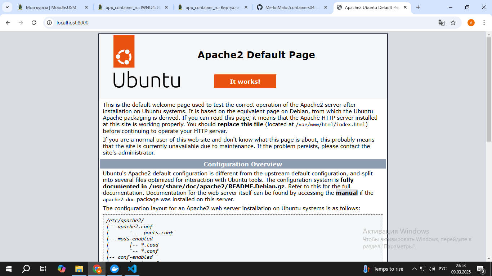

# Первый контейнер

## Цель работы:

Данная лабораторная работа призвана напомнить основные команды ОС Debian/Ubuntu. Также она позволит познакомиться с Docker и его основными командами.

## Задание

Запустить контейнер Ubuntu, установить Web-сервер Apache и вывести в браузере страницу с текстом "Hello, World!".

## Описание выполнения работы с ответами на вопросы

1. Создал репозиторий containers04 и склонировал его себе на комп:

2. В терминале запускаем контейнер ubuntu:

`docker run -ti -p 8000:80 --name containers04 ubuntu bash`

- `docker run ` — запускает новый контейнер.

- `-ti` — интерактивный режим с терминалом.

- `-p 8000:80 `— перенаправление порта 8000 на порт 80 контейнера.

- `--name containers04` — имя контейнера.

- `ubuntu` — образ, на основе которого создается контейнер.

- `bash` — запускает оболочку bash внутри контейнера.

3. Дальше ставим apache:

Обновляем список пакетов:

`apt update`

```
Get:1 http://archive.ubuntu.com/ubuntu noble InRelease [256 kB]
Get:2 http://security.ubuntu.com/ubuntu noble-security InRelease [126 kB]
Get:3 http://archive.ubuntu.com/ubuntu noble-updates InRelease [126 kB]  
Get:4 http://archive.ubuntu.com/ubuntu noble-backports InRelease [126 kB]
Get:5 http://archive.ubuntu.com/ubuntu noble/universe amd64 Packages [19.3 MB]
Get:6 http://security.ubuntu.com/ubuntu noble-security/multiverse amd64 Packages [34.0 kB]
Get:7 http://security.ubuntu.com/ubuntu noble-security/universe amd64 Packages [1062 kB]
Get:8 http://security.ubuntu.com/ubuntu noble-security/main amd64 Packages [841 kB]
Get:9 http://security.ubuntu.com/ubuntu noble-security/restricted amd64 Packages [909 kB] 
Get:10 http://archive.ubuntu.com/ubuntu noble/main amd64 Packages [1808 kB]
Get:11 http://archive.ubuntu.com/ubuntu noble/multiverse amd64 Packages [331 kB]
Get:12 http://archive.ubuntu.com/ubuntu noble/restricted amd64 Packages [117 kB]
Get:13 http://archive.ubuntu.com/ubuntu noble-updates/multiverse amd64 Packages [38.7 kB]
Get:14 http://archive.ubuntu.com/ubuntu noble-updates/main amd64 Packages [1163 kB]
Get:15 http://archive.ubuntu.com/ubuntu noble-updates/restricted amd64 Packages [955 kB]
Get:16 http://archive.ubuntu.com/ubuntu noble-updates/universe amd64 Packages [1345 kB]
Get:17 http://archive.ubuntu.com/ubuntu noble-backports/universe amd64 Packages [16.0 kB]
Fetched 28.6 MB in 7s (3910 kB/s)
Reading package lists... Done
Building dependency tree... Done
Reading state information... Done
18 packages can be upgraded. Run 'apt list --upgradable' to see them.
```

Ставим apache:

`apt install apache2 -y`

```
Reading package lists... Done
Building dependency tree... Done
Reading state information... Done
The following additional packages will be installed:
  adduser apache2-bin apache2-data apache2-utils ca-certificates krb5-locales libapr1t64 libaprutil1-dbd-sqlite3 libaprutil1-ldap libaprutil1t64 libbrotli1
  libcurl4t64 libexpat1 libgdbm-compat4t64 libgdbm6t64 libgssapi-krb5-2 libicu74 libjansson4 libk5crypto3 libkeyutils1 libkrb5-3 libkrb5support0
  libldap-common libldap2 liblua5.4-0 libnghttp2-14 libperl5.38t64 libpsl5t64 librtmp1 libsasl2-2 libsasl2-modules libsasl2-modules-db libsqlite3-0 libssh-4   
  libssl3t64 libxml2 media-types netbase openssl perl perl-base perl-modules-5.38 publicsuffix ssl-cert
Suggested packages:
  liblocale-gettext-perl cron quota ecryptfs-utils apache2-doc apache2-suexec-pristine | apache2-suexec-custom www-browser ufw gdbm-l10n krb5-doc krb5-user    
  libsasl2-modules-gssapi-mit | libsasl2-modules-gssapi-heimdal libsasl2-modules-ldap libsasl2-modules-otp libsasl2-modules-sql perl-doc
  libterm-readline-gnu-perl | libterm-readline-perl-perl make libtap-harness-archive-perl
The following NEW packages will be installed:
  adduser apache2 apache2-bin apache2-data apache2-utils ca-certificates krb5-locales libapr1t64 libaprutil1-dbd-sqlite3 libaprutil1-ldap libaprutil1t64
  libbrotli1 libcurl4t64 libexpat1 libgdbm-compat4t64 libgdbm6t64 libgssapi-krb5-2 libicu74 libjansson4 libk5crypto3 libkeyutils1 libkrb5-3 libkrb5support0    
  libldap-common libldap2 liblua5.4-0 libnghttp2-14 libperl5.38t64 libpsl5t64 librtmp1 libsasl2-2 libsasl2-modules libsasl2-modules-db libsqlite3-0 libssh-4   
  libxml2 media-types netbase openssl perl perl-modules-5.38 publicsuffix ssl-cert
The following packages will be upgraded:
  libssl3t64 perl-base
2 upgraded, 43 newly installed, 0 to remove and 16 not upgraded.
Need to get 30.0 MB of archives.
After this operation, 109 MB of additional disk space will be used.
Get:1 http://archive.ubuntu.com/ubuntu noble-updates/main amd64 perl-base amd64 5.38.2-3.2build2.1 [1823 kB]
Get:2 http://archive.ubuntu.com/ubuntu noble-updates/main amd64 perl-modules-5.38 all 5.38.2-3.2build2.1 [3110 kB]
Get:3 http://archive.ubuntu.com/ubuntu noble/main amd64 libgdbm6t64 amd64 1.23-5.1build1 [34.4 kB]
Get:4 http://archive.ubuntu.com/ubuntu noble/main amd64 libgdbm-compat4t64 amd64 1.23-5.1build1 [6710 B]
Get:5 http://archive.ubuntu.com/ubuntu noble-updates/main amd64 libperl5.38t64 amd64 5.38.2-3.2build2.1 [4867 kB]
Get:6 http://archive.ubuntu.com/ubuntu noble-updates/main amd64 perl amd64 5.38.2-3.2build2.1 [231 kB]
Get:7 http://archive.ubuntu.com/ubuntu noble-updates/main amd64 libapr1t64 amd64 1.7.2-3.1ubuntu0.1 [108 kB]
Get:8 http://archive.ubuntu.com/ubuntu noble-updates/main amd64 libexpat1 amd64 2.6.1-2ubuntu0.2 [87.4 kB]
Get:9 http://archive.ubuntu.com/ubuntu noble-updates/main amd64 libssl3t64 amd64 3.0.13-0ubuntu3.5 [1940 kB]
Get:10 http://archive.ubuntu.com/ubuntu noble/main amd64 libaprutil1t64 amd64 1.6.3-1.1ubuntu7 [91.9 kB]
Get:11 http://archive.ubuntu.com/ubuntu noble-updates/main amd64 libsqlite3-0 amd64 3.45.1-1ubuntu2.1 [701 kB]
Get:12 http://archive.ubuntu.com/ubuntu noble/main amd64 libaprutil1-dbd-sqlite3 amd64 1.6.3-1.1ubuntu7 [11.2 kB]
Get:13 http://archive.ubuntu.com/ubuntu noble-updates/main amd64 libsasl2-modules-db amd64 2.1.28+dfsg1-5ubuntu3.1 [20.4 kB]
Get:14 http://archive.ubuntu.com/ubuntu noble-updates/main amd64 libsasl2-2 amd64 2.1.28+dfsg1-5ubuntu3.1 [53.2 kB]
Get:15 http://archive.ubuntu.com/ubuntu noble-updates/main amd64 libldap2 amd64 2.6.7+dfsg-1~exp1ubuntu8.2 [196 kB]
Get:16 http://archive.ubuntu.com/ubuntu noble/main amd64 libaprutil1-ldap amd64 1.6.3-1.1ubuntu7 [9116 B]
Get:17 http://archive.ubuntu.com/ubuntu noble/main amd64 libbrotli1 amd64 1.1.0-2build2 [331 kB]
Get:18 http://archive.ubuntu.com/ubuntu noble-updates/main amd64 libkrb5support0 amd64 1.20.1-6ubuntu2.5 [34.1 kB]
Get:19 http://archive.ubuntu.com/ubuntu noble-updates/main amd64 libk5crypto3 amd64 1.20.1-6ubuntu2.5 [82.0 kB]
Get:20 http://archive.ubuntu.com/ubuntu noble/main amd64 libkeyutils1 amd64 1.6.3-3build1 [9490 B]
Get:21 http://archive.ubuntu.com/ubuntu noble-updates/main amd64 libkrb5-3 amd64 1.20.1-6ubuntu2.5 [347 kB]
Get:22 http://archive.ubuntu.com/ubuntu noble-updates/main amd64 libgssapi-krb5-2 amd64 1.20.1-6ubuntu2.5 [143 kB]
Get:23 http://archive.ubuntu.com/ubuntu noble-updates/main amd64 libnghttp2-14 amd64 1.59.0-1ubuntu0.2 [74.3 kB]
Get:24 http://archive.ubuntu.com/ubuntu noble/main amd64 libpsl5t64 amd64 0.21.2-1.1build1 [57.1 kB]
Get:25 http://archive.ubuntu.com/ubuntu noble/main amd64 librtmp1 amd64 2.4+20151223.gitfa8646d.1-2build7 [56.3 kB]
Get:26 http://archive.ubuntu.com/ubuntu noble/main amd64 libssh-4 amd64 0.10.6-2build2 [188 kB]
Get:27 http://archive.ubuntu.com/ubuntu noble-updates/main amd64 libcurl4t64 amd64 8.5.0-2ubuntu10.6 [341 kB]
Get:28 http://archive.ubuntu.com/ubuntu noble/main amd64 libjansson4 amd64 2.14-2build2 [32.8 kB]
Get:29 http://archive.ubuntu.com/ubuntu noble/main amd64 liblua5.4-0 amd64 5.4.6-3build2 [166 kB]
Get:30 http://archive.ubuntu.com/ubuntu noble-updates/main amd64 libicu74 amd64 74.2-1ubuntu3.1 [10.9 MB]
Get:31 http://archive.ubuntu.com/ubuntu noble-updates/main amd64 libxml2 amd64 2.9.14+dfsg-1.3ubuntu3.2 [763 kB]
Get:32 http://archive.ubuntu.com/ubuntu noble-updates/main amd64 apache2-bin amd64 2.4.58-1ubuntu8.5 [1329 kB]
Get:33 http://archive.ubuntu.com/ubuntu noble-updates/main amd64 apache2-data all 2.4.58-1ubuntu8.5 [163 kB]
Get:34 http://archive.ubuntu.com/ubuntu noble-updates/main amd64 apache2-utils amd64 2.4.58-1ubuntu8.5 [97.1 kB]
Get:35 http://archive.ubuntu.com/ubuntu noble/main amd64 media-types all 10.1.0 [27.5 kB]
Get:36 http://archive.ubuntu.com/ubuntu noble-updates/main amd64 apache2 amd64 2.4.58-1ubuntu8.5 [90.2 kB]
Enabling conf serve-cgi-bin.
Enabling site 000-default.
invoke-rc.d: could not determine current runlevel
invoke-rc.d: policy-rc.d denied execution of start.
Processing triggers for libc-bin (2.39-0ubuntu8.3) ...
Processing triggers for ca-certificates (20240203) ...
Updating certificates in /etc/ssl/certs...
0 added, 0 removed; done.
Running hooks in /etc/ca-certificates/update.d...
done.
```

Запускаем:

`service apache2 start`

```
 * Starting Apache httpd web server apache2
AH00558: apache2: Could not reliably determine the server's fully qualified domain name, using 172.17.0.2. Set the 'ServerName' directive globally to suppress 
this message
 * 
```

4. Проверка веба

Проверил работает ли веб-сервер, забив адрес в браузере `http://localhost:8000`

Получил : 



5. Создание своей страницы

Проверяем содержимое папки веб-сервера:

`ls -l /var/www/html/`

```
total 12
-rw-r--r-- 1 root root 10671 Mar  9 21:48 index.html
```

Создал файл index.html с текстом "Hello, World!":

`echo '<h1>Hello, World!</h1>' > /var/www/html/index.html`

Обновил страницу в браузере и теперь просто надпись "Hello, World!"

6. Проверка конфигурации Apache

Переход в директорию настроек сайтов:

`cd /etc/apache2/sites-enabled/`

Просмотр конфигурации по умолчанию:

`cat 000-default.conf`

**Объяснение**: файл 000-default.conf содержит основные настройки виртуального хоста Apache.

7. Выход

Команда ` exit `

8. Управление контейнерами

Просмотр списка всех контейнеров:

`docker ps -a`

Удаление контейнера:

`docker rm containers04`

## Выводы

В ходе выполнения лабораторной работы :

- Освоил базовые команды Docker.

- Установил и запустил веб-сервер Apache в контейнере.

- Настроил и вывел пользовательскую веб-страницу.

- Ознакомилися с Apache и управлением Docker-контейнерами.

## Используемые источники


Курс moodle usm : "Контейнеризация и виртуализация"


PS F:\containers04> docker run -ti -p 8000:80 --name containers04 ubuntu bash      
Unable to find image 'ubuntu:latest' locally
latest: Pulling from library/ubuntu
5a7813e071bf: Download complete
Digest: sha256:72297848456d5d37d1262630108ab308d3e9ec7ed1c3286a32fe09856619a782
Status: Downloaded newer image for ubuntu:latest
root@0b7eb2d08268:/# apt update
Get:1 http://archive.ubuntu.com/ubuntu noble InRelease [256 kB]
Get:2 http://security.ubuntu.com/ubuntu noble-security InRelease [126 kB]
Get:3 http://archive.ubuntu.com/ubuntu noble-updates InRelease [126 kB]  
Get:4 http://archive.ubuntu.com/ubuntu noble-backports InRelease [126 kB]
Get:5 http://archive.ubuntu.com/ubuntu noble/universe amd64 Packages [19.3 MB]
Get:6 http://security.ubuntu.com/ubuntu noble-security/multiverse amd64 Packages [34.0 kB]
Get:7 http://security.ubuntu.com/ubuntu noble-security/universe amd64 Packages [1062 kB]
Get:8 http://security.ubuntu.com/ubuntu noble-security/main amd64 Packages [841 kB]
Get:9 http://security.ubuntu.com/ubuntu noble-security/restricted amd64 Packages [909 kB] 
Get:10 http://archive.ubuntu.com/ubuntu noble/main amd64 Packages [1808 kB]
Get:11 http://archive.ubuntu.com/ubuntu noble/multiverse amd64 Packages [331 kB]
Get:12 http://archive.ubuntu.com/ubuntu noble/restricted amd64 Packages [117 kB]
Get:13 http://archive.ubuntu.com/ubuntu noble-updates/multiverse amd64 Packages [38.7 kB]
Get:14 http://archive.ubuntu.com/ubuntu noble-updates/main amd64 Packages [1163 kB]
Get:15 http://archive.ubuntu.com/ubuntu noble-updates/restricted amd64 Packages [955 kB]
Get:16 http://archive.ubuntu.com/ubuntu noble-updates/universe amd64 Packages [1345 kB]
Get:17 http://archive.ubuntu.com/ubuntu noble-backports/universe amd64 Packages [16.0 kB]
Fetched 28.6 MB in 7s (3910 kB/s)
Reading package lists... Done
Building dependency tree... Done
Reading state information... Done
18 packages can be upgraded. Run 'apt list --upgradable' to see them.
root@0b7eb2d08268:/# apt install apache2 -y
Reading package lists... Done
Building dependency tree... Done
Reading state information... Done
The following additional packages will be installed:
  adduser apache2-bin apache2-data apache2-utils ca-certificates krb5-locales libapr1t64 libaprutil1-dbd-sqlite3 libaprutil1-ldap libaprutil1t64 libbrotli1
  libcurl4t64 libexpat1 libgdbm-compat4t64 libgdbm6t64 libgssapi-krb5-2 libicu74 libjansson4 libk5crypto3 libkeyutils1 libkrb5-3 libkrb5support0
  libldap-common libldap2 liblua5.4-0 libnghttp2-14 libperl5.38t64 libpsl5t64 librtmp1 libsasl2-2 libsasl2-modules libsasl2-modules-db libsqlite3-0 libssh-4   
  libssl3t64 libxml2 media-types netbase openssl perl perl-base perl-modules-5.38 publicsuffix ssl-cert
Suggested packages:
  liblocale-gettext-perl cron quota ecryptfs-utils apache2-doc apache2-suexec-pristine | apache2-suexec-custom www-browser ufw gdbm-l10n krb5-doc krb5-user    
  libsasl2-modules-gssapi-mit | libsasl2-modules-gssapi-heimdal libsasl2-modules-ldap libsasl2-modules-otp libsasl2-modules-sql perl-doc
  libterm-readline-gnu-perl | libterm-readline-perl-perl make libtap-harness-archive-perl
The following NEW packages will be installed:
  adduser apache2 apache2-bin apache2-data apache2-utils ca-certificates krb5-locales libapr1t64 libaprutil1-dbd-sqlite3 libaprutil1-ldap libaprutil1t64
  libbrotli1 libcurl4t64 libexpat1 libgdbm-compat4t64 libgdbm6t64 libgssapi-krb5-2 libicu74 libjansson4 libk5crypto3 libkeyutils1 libkrb5-3 libkrb5support0    
  libldap-common libldap2 liblua5.4-0 libnghttp2-14 libperl5.38t64 libpsl5t64 librtmp1 libsasl2-2 libsasl2-modules libsasl2-modules-db libsqlite3-0 libssh-4   
  libxml2 media-types netbase openssl perl perl-modules-5.38 publicsuffix ssl-cert
The following packages will be upgraded:
  libssl3t64 perl-base
2 upgraded, 43 newly installed, 0 to remove and 16 not upgraded.
Need to get 30.0 MB of archives.
After this operation, 109 MB of additional disk space will be used.
Get:1 http://archive.ubuntu.com/ubuntu noble-updates/main amd64 perl-base amd64 5.38.2-3.2build2.1 [1823 kB]
Get:2 http://archive.ubuntu.com/ubuntu noble-updates/main amd64 perl-modules-5.38 all 5.38.2-3.2build2.1 [3110 kB]
Get:3 http://archive.ubuntu.com/ubuntu noble/main amd64 libgdbm6t64 amd64 1.23-5.1build1 [34.4 kB]
Get:4 http://archive.ubuntu.com/ubuntu noble/main amd64 libgdbm-compat4t64 amd64 1.23-5.1build1 [6710 B]
Get:5 http://archive.ubuntu.com/ubuntu noble-updates/main amd64 libperl5.38t64 amd64 5.38.2-3.2build2.1 [4867 kB]
Get:6 http://archive.ubuntu.com/ubuntu noble-updates/main amd64 perl amd64 5.38.2-3.2build2.1 [231 kB]
Get:7 http://archive.ubuntu.com/ubuntu noble-updates/main amd64 libapr1t64 amd64 1.7.2-3.1ubuntu0.1 [108 kB]
Get:8 http://archive.ubuntu.com/ubuntu noble-updates/main amd64 libexpat1 amd64 2.6.1-2ubuntu0.2 [87.4 kB]
Get:9 http://archive.ubuntu.com/ubuntu noble-updates/main amd64 libssl3t64 amd64 3.0.13-0ubuntu3.5 [1940 kB]
Get:10 http://archive.ubuntu.com/ubuntu noble/main amd64 libaprutil1t64 amd64 1.6.3-1.1ubuntu7 [91.9 kB]
Get:11 http://archive.ubuntu.com/ubuntu noble-updates/main amd64 libsqlite3-0 amd64 3.45.1-1ubuntu2.1 [701 kB]
Get:12 http://archive.ubuntu.com/ubuntu noble/main amd64 libaprutil1-dbd-sqlite3 amd64 1.6.3-1.1ubuntu7 [11.2 kB]
Get:13 http://archive.ubuntu.com/ubuntu noble-updates/main amd64 libsasl2-modules-db amd64 2.1.28+dfsg1-5ubuntu3.1 [20.4 kB]
Get:14 http://archive.ubuntu.com/ubuntu noble-updates/main amd64 libsasl2-2 amd64 2.1.28+dfsg1-5ubuntu3.1 [53.2 kB]
Get:15 http://archive.ubuntu.com/ubuntu noble-updates/main amd64 libldap2 amd64 2.6.7+dfsg-1~exp1ubuntu8.2 [196 kB]
Get:16 http://archive.ubuntu.com/ubuntu noble/main amd64 libaprutil1-ldap amd64 1.6.3-1.1ubuntu7 [9116 B]
Get:17 http://archive.ubuntu.com/ubuntu noble/main amd64 libbrotli1 amd64 1.1.0-2build2 [331 kB]
Get:18 http://archive.ubuntu.com/ubuntu noble-updates/main amd64 libkrb5support0 amd64 1.20.1-6ubuntu2.5 [34.1 kB]
Get:19 http://archive.ubuntu.com/ubuntu noble-updates/main amd64 libk5crypto3 amd64 1.20.1-6ubuntu2.5 [82.0 kB]
Get:20 http://archive.ubuntu.com/ubuntu noble/main amd64 libkeyutils1 amd64 1.6.3-3build1 [9490 B]
Get:21 http://archive.ubuntu.com/ubuntu noble-updates/main amd64 libkrb5-3 amd64 1.20.1-6ubuntu2.5 [347 kB]
Get:22 http://archive.ubuntu.com/ubuntu noble-updates/main amd64 libgssapi-krb5-2 amd64 1.20.1-6ubuntu2.5 [143 kB]
Get:23 http://archive.ubuntu.com/ubuntu noble-updates/main amd64 libnghttp2-14 amd64 1.59.0-1ubuntu0.2 [74.3 kB]
Get:24 http://archive.ubuntu.com/ubuntu noble/main amd64 libpsl5t64 amd64 0.21.2-1.1build1 [57.1 kB]
Get:25 http://archive.ubuntu.com/ubuntu noble/main amd64 librtmp1 amd64 2.4+20151223.gitfa8646d.1-2build7 [56.3 kB]
Get:26 http://archive.ubuntu.com/ubuntu noble/main amd64 libssh-4 amd64 0.10.6-2build2 [188 kB]
Get:27 http://archive.ubuntu.com/ubuntu noble-updates/main amd64 libcurl4t64 amd64 8.5.0-2ubuntu10.6 [341 kB]
Get:28 http://archive.ubuntu.com/ubuntu noble/main amd64 libjansson4 amd64 2.14-2build2 [32.8 kB]
Get:29 http://archive.ubuntu.com/ubuntu noble/main amd64 liblua5.4-0 amd64 5.4.6-3build2 [166 kB]
Get:30 http://archive.ubuntu.com/ubuntu noble-updates/main amd64 libicu74 amd64 74.2-1ubuntu3.1 [10.9 MB]
Get:31 http://archive.ubuntu.com/ubuntu noble-updates/main amd64 libxml2 amd64 2.9.14+dfsg-1.3ubuntu3.2 [763 kB]
Get:32 http://archive.ubuntu.com/ubuntu noble-updates/main amd64 apache2-bin amd64 2.4.58-1ubuntu8.5 [1329 kB]
Get:33 http://archive.ubuntu.com/ubuntu noble-updates/main amd64 apache2-data all 2.4.58-1ubuntu8.5 [163 kB]
Get:34 http://archive.ubuntu.com/ubuntu noble-updates/main amd64 apache2-utils amd64 2.4.58-1ubuntu8.5 [97.1 kB]
Get:35 http://archive.ubuntu.com/ubuntu noble/main amd64 media-types all 10.1.0 [27.5 kB]
Get:36 http://archive.ubuntu.com/ubuntu noble-updates/main amd64 apache2 amd64 2.4.58-1ubuntu8.5 [90.2 kB]
Enabling conf serve-cgi-bin.
Enabling site 000-default.
invoke-rc.d: could not determine current runlevel
invoke-rc.d: policy-rc.d denied execution of start.
Processing triggers for libc-bin (2.39-0ubuntu8.3) ...
Processing triggers for ca-certificates (20240203) ...
Updating certificates in /etc/ssl/certs...
0 added, 0 removed; done.
Running hooks in /etc/ca-certificates/update.d...
done.
root@0b7eb2d08268:/# service apache2 start
 * Starting Apache httpd web server apache2
AH00558: apache2: Could not reliably determine the server's fully qualified domain name, using 172.17.0.2. Set the 'ServerName' directive globally to suppress 
this message